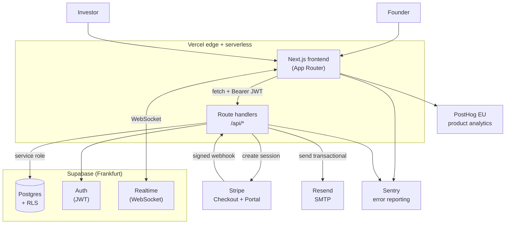
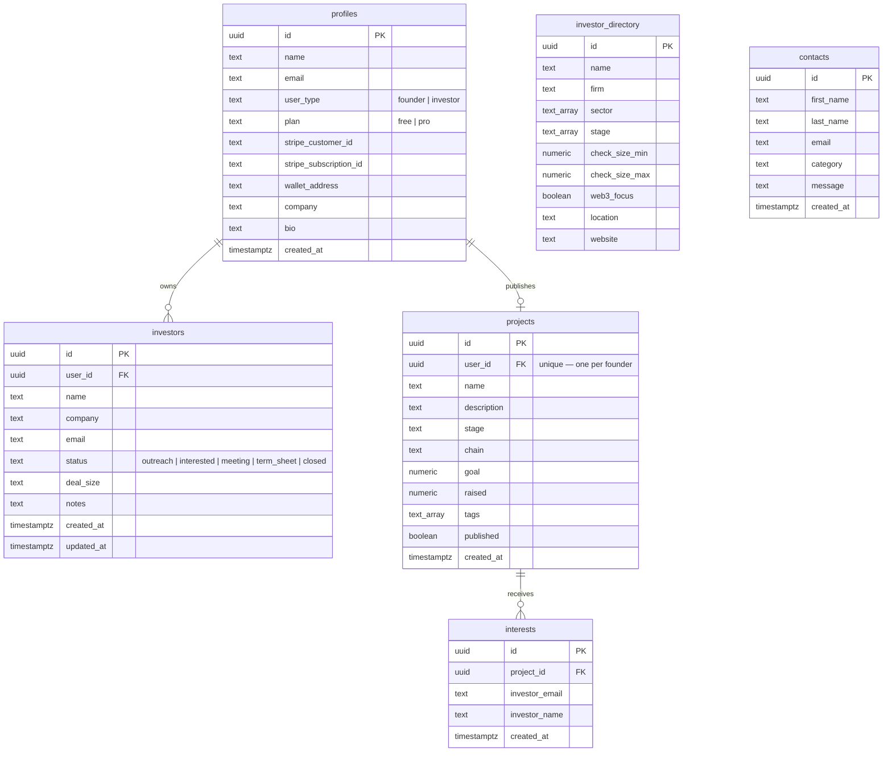
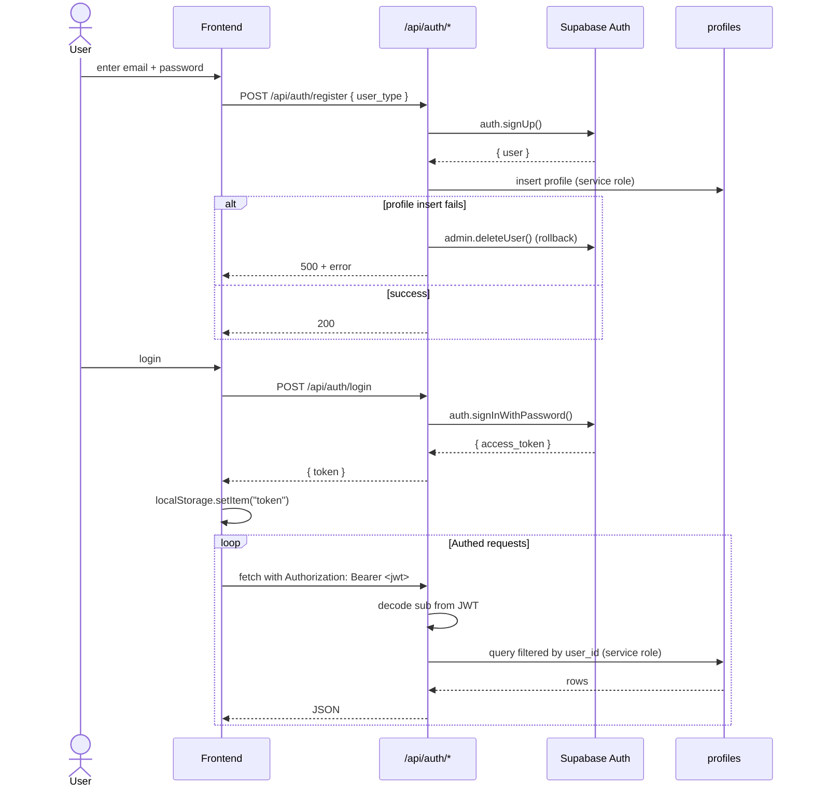
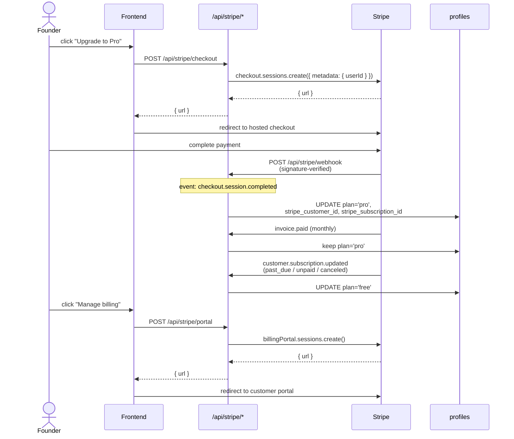
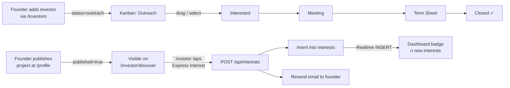

<h1 align="left">
  <picture>
    <source media="(prefers-color-scheme: dark)" srcset="./frontend/public/fundflow-wordmark-dark.svg">
    
  </picture>
</h1>

Investor CRM for Web3 founders. Private pipeline for tracking investor
relationships end-to-end, a public deal-flow page for inbound interest, and
analytics to tell you where the round actually stands.

**Live:** <https://fundflow-omega.vercel.app>
&nbsp;·&nbsp;
**Built by:** [Michael Kurz](https://www.linkedin.com/in/kurzmichael02)

---

## Contents

- [Stack](#stack)
- [System architecture](#system-architecture)
- [Data model](#data-model)
- [Auth flow](#auth-flow)
- [Billing flow](#billing-flow)
- [Deal-flow lifecycle](#deal-flow-lifecycle)
- [API](#api)
- [Project layout](#project-layout)
- [Local development](#local-development)
- [Deploy](#deploy)
- [Security notes](#security-notes)
- [Team](#team)

---

## Stack

| Layer | Choice |
|---|---|
| Frontend | Next.js 16 (App Router, Turbopack), React 19, TypeScript, TailwindCSS v4 |
| Backend | Next.js route handlers (`app/api/**`) — serverless on Vercel |
| Database | Supabase Postgres, Frankfurt region |
| Auth | Supabase Auth (email + password, recovery flow) |
| Realtime | Supabase Realtime (`postgres_changes` over WebSocket) |
| Payments | Stripe Checkout + Customer Portal + signed webhooks |
| Email | Resend (transactional, contact form + new-interest notifications) |
| Web3 | MetaMask (EIP-1193) and WalletConnect v2 via Reown |
| Monitoring | Sentry (runtime errors), PostHog EU (product analytics) |
| Hosting | Vercel, CI/CD on `main` |

The whole server side lives in `frontend/app/api/**`. There is no separate
backend process — all dynamic routes run as Vercel serverless functions.

---

## System architecture



Client requests are served from the Vercel edge for static pages and from
serverless functions for `/api/*`. The frontend talks to Supabase in two
ways: REST through our own API routes for anything needing the service-role
key, and Realtime directly over WebSocket for dashboard live updates.

---

## Data model



**Column ownership** — who may write which columns:

- `profiles.plan` and `profiles.stripe_*` — **server-only**, written
  exclusively by the Stripe webhook handler.
- `profiles.user_type` and `profiles.email` — **immutable after creation**,
  set once by the register route.
- `profiles.name` / `company` / `bio` / `wallet_address` — **user-writable**
  via `PATCH /api/profile` (enforced by a whitelist on the server).
- `investors.*` — **user-writable** within the caller's own rows
  (`WHERE user_id = auth.uid()`).
- `projects.user_id` / `created_at` — pinned by the server; the body
  whitelist in `POST /api/projects` ignores any client-supplied value.

Row-Level Security is on for every table. `projects` has a public read
policy scoped to `published = true`; `investor_directory` is public read-only.

---

## Auth flow



**Password recovery** uses `supabase.auth.resetPasswordForEmail` from the
client with `redirectTo=/reset-password`. The reset page handles both
PKCE (`?code=`) and implicit (hash-token) callbacks, then calls
`supabase.auth.updateUser({ password })`. The success state is identical
whether or not the address exists — we don't leak registered emails.

---

## Billing flow



Free plan is capped at 25 investors — the check lives in
`POST /api/investors`. Upgrading requires the user to go through Stripe
Checkout; the `plan` column is never client-writable.

---

## Deal-flow lifecycle

How a single deal travels through the system, from founder outreach to
investor interest.



Both halves (private pipeline + public deal flow) feed the same analytics
funnel at `/analytics`.

---

## API

All `✓` routes require `Authorization: Bearer <supabase-jwt>`. Unauth routes
are either public reads or webhook endpoints.

| Method | Route | Auth | Notes |
|---|---|:---:|---|
| POST | `/api/auth/register` | — | Body: `{ name, email, password, user_type }`. `user_type` ∈ `founder \| investor`, defaults to `founder`. Rolls back the auth user if the profile insert fails. |
| POST | `/api/auth/login` | — | Returns `{ token, user }`. |
| GET | `/api/profile` | ✓ | Returns the caller's profile. |
| PATCH | `/api/profile` | ✓ | Whitelisted fields: `name`, `company`, `bio`, `wallet_address`. Nothing else goes through. |
| GET | `/api/investors` | ✓ | Ordered by `created_at desc`. |
| POST | `/api/investors` | ✓ | 25-row cap for `plan='free'`; returns `{ error, limit: true }` with 403 when hit. |
| PATCH | `/api/investors?id=…` | ✓ | Scoped by `user_id` in WHERE. |
| DELETE | `/api/investors?id=…` | ✓ | |
| GET | `/api/projects` | — | Public — joins `profiles(name, company)` for the deal-flow cards. |
| POST | `/api/projects` | ✓ | Upsert; whitelisted fields: `name, description, stage, chain, goal, raised, tags, published`. |
| PATCH | `/api/projects` | ✓ | Returns the caller's own project (misnomer — it's a server-scoped GET; keeping the verb to avoid breaking the frontend). |
| GET | `/api/interests` | ✓ | Joins `projects(name)`, filtered to the caller's projects. |
| POST | `/api/interests` | — | Called by investors. Deduplicates by `(project_id, investor_email)`, fires a Resend email to the founder. |
| GET | `/api/investor-directory` | — | Read-only curated list. |
| POST | `/api/contact` | — | HTML-escaped + length-capped, sends to the team inbox. |
| POST | `/api/stripe/checkout` | ✓ | Creates a subscription Checkout session. |
| POST | `/api/stripe/portal` | ✓ | Requires existing `stripe_customer_id`. |
| POST | `/api/stripe/webhook` | — | Signature-verified via `STRIPE_WEBHOOK_SECRET`. |

---

## Project layout

```
frontend/
├── app/
│   ├── page.tsx                Landing
│   ├── about/ contact/ privacy/ terms/
│   ├── login/ register/        Founder auth
│   ├── forgot-password/
│   ├── reset-password/         PKCE + implicit callbacks
│   ├── dashboard/              Realtime-driven overview
│   ├── investors/              CRM table, CSV export, detail panel
│   │   └── database/           Curated directory
│   ├── pipeline/               Kanban
│   ├── analytics/              Funnel + conversion
│   ├── profile/                Profile + wallet + project editor
│   ├── investor/               Investor portal
│   │   ├── page.tsx            Login
│   │   ├── register/
│   │   └── discover/           Public deal flow
│   └── api/                    See API table above
├── components/
│   ├── Navbar.tsx
│   ├── Toast.tsx
│   ├── ConfirmDialog.tsx
│   └── CookieBanner.tsx
└── lib/
    ├── api.ts                  fetch wrapper that attaches the Bearer JWT
    ├── supabase.ts             browser-side anon client (singleton)
    └── escapeHtml.ts           used by email templates
```

---

## Local development

```bash
git clone https://github.com/kurzmichael02-hue/fundflow.git
cd fundflow/frontend
npm install
cp .env.local.example .env.local      # then fill in the values below
npm run dev
```

### Required env vars

```env
# Supabase
NEXT_PUBLIC_SUPABASE_URL
NEXT_PUBLIC_SUPABASE_ANON_KEY
SUPABASE_SERVICE_ROLE_KEY
# Used by every authed API route to verify the JWT signature. Grab it from
# Supabase → Settings → API → JWT Settings. Routes refuse to boot without it.
SUPABASE_JWT_SECRET

# Stripe
STRIPE_SECRET_KEY
NEXT_PUBLIC_STRIPE_PUBLISHABLE_KEY
STRIPE_WEBHOOK_SECRET
# Price ID for the Pro plan — optional, has a hardcoded fallback.
STRIPE_PRO_PRICE_ID

# Email
RESEND_API_KEY

# Public base URL — used for metadataBase, sitemap, OAuth redirects,
# password-reset redirects. Defaults to the Vercel preview URL if unset.
NEXT_PUBLIC_SITE_URL

# Rate limiting (Upstash Redis). If not set, limiters degrade to no-op
# which is fine for local dev. Set UPSTASH_REQUIRED=true on production
# environments to make the request 503 instead of silently letting
# traffic through when the limiter is missing.
UPSTASH_REDIS_REST_URL
UPSTASH_REDIS_REST_TOKEN
UPSTASH_REQUIRED

# Optional
NEXT_PUBLIC_POSTHOG_KEY
NEXT_PUBLIC_POSTHOG_HOST
```

Resend, Stripe and the Supabase service client are all **lazy-initialised**,
so a missing key only breaks the specific request that needs it — the build
itself runs clean even without production secrets in scope. This matters
for `next build` on a fresh machine and for CI.

### Stripe webhooks locally

```bash
stripe listen --forward-to localhost:3000/api/stripe/webhook
# copy the whsec_… it prints into STRIPE_WEBHOOK_SECRET in .env.local
```

---

## Deploy

`main` auto-deploys to Vercel. Before shipping:

1. All env vars above must be set on the Vercel project.
2. The Stripe webhook endpoint must point at
   `https://<your-domain>/api/stripe/webhook` with `STRIPE_WEBHOOK_SECRET`
   matching.
3. Supabase **Auth → URL Configuration → Site URL** must match
   `NEXT_PUBLIC_SITE_URL`, otherwise password-reset emails bounce the user
   onto a stale domain.

---

## Security notes

Things that are done, and things that are explicitly still open so they
don't get lost:

**Enforced**

- Every authed API route calls `requireUser(req)` from `lib/auth.ts`, which
  verifies the JWT signature against `SUPABASE_JWT_SECRET` using `jose`
  (HS256). Forged tokens are rejected with 401 before the handler runs —
  we never again trust a `sub` claim that wasn't signed by Supabase.
- `POST /api/investors`, `PATCH /api/investors`, `PATCH /api/profile` and
  `POST /api/projects` use server-side whitelists. A client can't upgrade
  its own plan, write a foreign `user_id`, or set `created_at` through the
  API.
- `POST /api/auth/login` accepts a `portal: "founder" | "investor"` hint
  and 403s if the account's `user_type` doesn't match — so a founder
  can't sign in through `/investor` even with valid credentials (and
  vice versa).
- Rate limiting on every abuseable public endpoint via Upstash
  (`lib/ratelimit.ts`): 10/min per IP + 5/5min per email on
  `/api/auth/login`, 5/hour on `/api/auth/register` and `/api/contact`,
  20/hour on `/api/interests`. Graceful no-op when Upstash env vars
  aren't set; set `UPSTASH_REQUIRED=true` in production to fail closed.
- `POST /api/interests` validates the email, caps field length, and
  dedups on `(project_id, investor_email)` using `maybeSingle()` —
  the old `.single()` call silently let duplicates through when zero or
  two-plus rows matched.
- `POST /api/stripe/checkout` blocks a second checkout if the user is
  already on Pro (prevents double-subscription) and reuses the existing
  `stripe_customer_id` instead of creating a duplicate Stripe customer
  on every click.
- All user-supplied text in email templates is HTML-escaped
  (`lib/escapeHtml.ts`); subject lines strip CR/LF to block header
  injection.
- Contact form has field-length caps, email-regex validation, and sends
  with `replyTo` set so the team inbox can reply without forwarding.
- Register uses the service-role client for the profile insert and rolls
  back the auth user (`admin.deleteUser`) if that insert fails — no
  orphan auth rows.
- Password recovery UI is response-identical whether or not the email is
  registered, so the endpoint can't be used for enumeration.
- CSV export in the CRM is RFC 4180-compliant (quotes doubled, UTF-8 BOM
  so Excel doesn't mangle umlauts).
- JWT decode in the browser uses URL-safe base64 padding — otherwise
  Supabase tokens with `-` / `_` / odd-length payloads fail to decode.
- Stripe, Resend and Supabase clients are lazy-initialised; missing keys
  don't crash the process on module load.

**Known gaps (tracked):**

- No audit log on `profiles.plan` or billing state changes. Useful for
  disputes; low priority today.
- Stripe webhook idempotency: we don't store `event.id` to guarantee each
  event is processed exactly once. Stripe retries are rare but do happen;
  at worst it re-applies the same `plan = "pro"` update.

---

## Team

| | |
|---|---|
| Taiwo "Crypton Jay" | Founder, CEO |
| Joshua Oyerinde | CTO |
| Michael Kurz | Technical Manager |

---

© 2026 FundFlow
