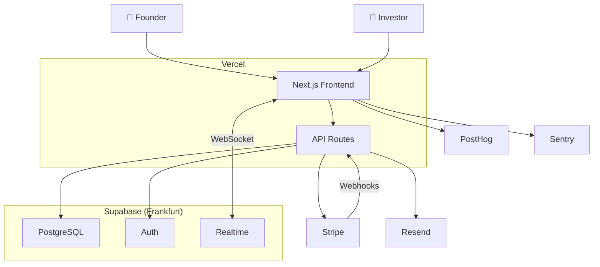
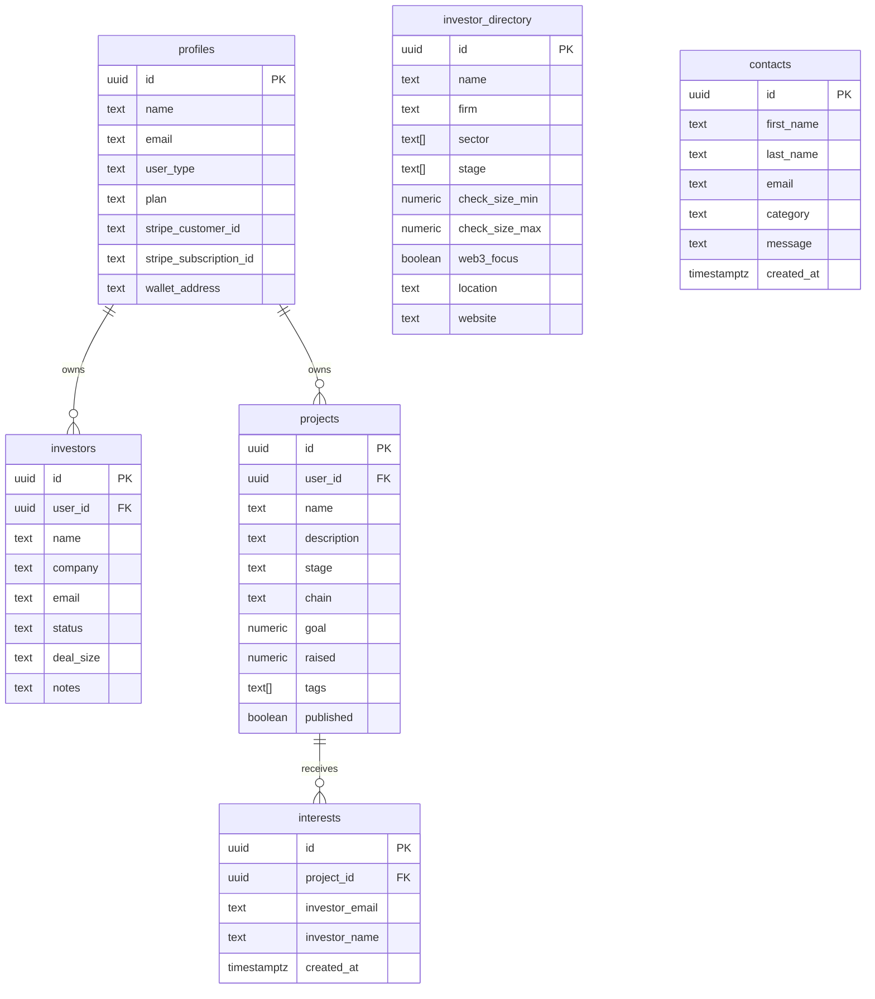
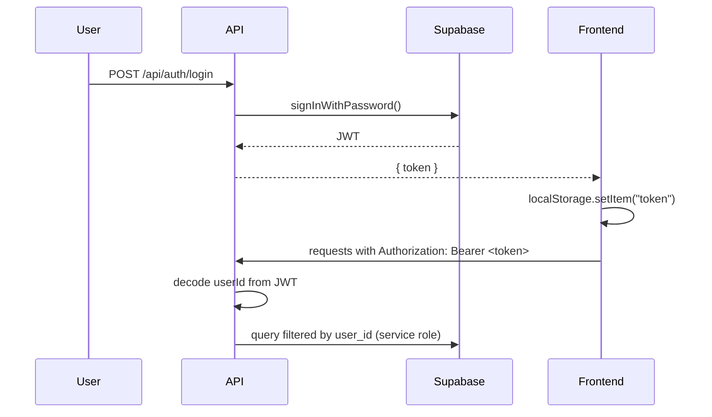
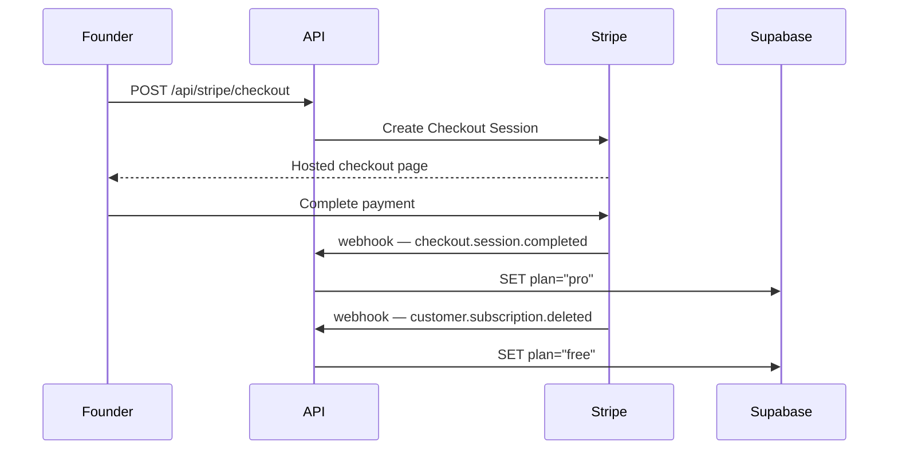

# FundFlow

> The investor CRM built for Web3 founders.

**Live:** [fundflow-omega.vercel.app](https://fundflow-omega.vercel.app)

---

## What is it?

FundFlow helps Web3 startup founders manage their entire fundraising process — track investor relationships, move deals through a pipeline, and connect with investors actively deploying capital.

Two user types: **Founders** manage their pipeline. **Investors** browse live deals and express interest.

---

## Tech Stack

| Layer | Technology |
|---|---|
| Frontend | Next.js, TypeScript, TailwindCSS |
| Backend | Next.js API Routes (serverless) |
| Database + Auth | Supabase (PostgreSQL + RLS + Realtime) |
| Payments | Stripe (Checkout, Customer Portal, Webhooks) |
| Hosting | Vercel |
| Email | Resend |
| Web3 | MetaMask, WalletConnect (Reown) |
| Analytics | PostHog (EU) |
| Monitoring | Sentry |

---

## System Architecture



---

## Database Schema



---

## Auth Flow



---

## Billing Flow



---

## API Routes

| Method | Route | Auth | Description |
|--------|-------|------|-------------|
| POST | `/api/auth/register` | — | Register founder or investor |
| POST | `/api/auth/login` | — | Login, returns JWT |
| GET | `/api/investors` | ✓ | Get all investors |
| POST | `/api/investors` | ✓ | Add investor (25 limit on free) |
| PATCH | `/api/investors?id=` | ✓ | Update investor |
| DELETE | `/api/investors?id=` | ✓ | Delete investor |
| GET | `/api/profile` | ✓ | Get profile |
| PATCH | `/api/profile` | ✓ | Update profile |
| GET | `/api/projects` | — | Get published projects |
| POST | `/api/projects` | ✓ | Create / update project |
| PATCH | `/api/projects` | ✓ | Get own project |
| GET | `/api/interests` | ✓ | Get deal flow interests |
| POST | `/api/interests` | — | Express interest (investor) |
| GET | `/api/investor-directory` | — | Curated investor list |
| POST | `/api/stripe/checkout` | ✓ | Create checkout session |
| POST | `/api/stripe/portal` | ✓ | Create billing portal session |
| POST | `/api/stripe/webhook` | — | Handle Stripe events |
| POST | `/api/contact` | — | Submit contact form |

---

## Getting Started

```bash
git clone https://github.com/kurzmichael02-hue/fundflow.git
cd fundflow/frontend
npm install
npm run dev
```

Create `frontend/.env.local`:

```env
NEXT_PUBLIC_SUPABASE_URL=
NEXT_PUBLIC_SUPABASE_ANON_KEY=
SUPABASE_SERVICE_ROLE_KEY=
STRIPE_SECRET_KEY=
NEXT_PUBLIC_STRIPE_PUBLISHABLE_KEY=
STRIPE_WEBHOOK_SECRET=
NEXT_PUBLIC_POSTHOG_KEY=
NEXT_PUBLIC_POSTHOG_HOST=
RESEND_API_KEY=
```

---

## Project Structure

```
fundflow/
└── frontend/
    ├── app/
    │   ├── page.tsx                  # Landing page
    │   ├── about/                    # About page
    │   ├── contact/                  # Contact form
    │   ├── privacy/                  # Privacy policy
    │   ├── terms/                    # Terms of service
    │   ├── login/                    # Founder login
    │   ├── register/                 # Founder register
    │   ├── dashboard/                # Dashboard + Realtime
    │   ├── investors/
    │   │   ├── page.tsx              # CRM table
    │   │   └── database/             # Curated investor database
    │   ├── pipeline/                 # Kanban pipeline
    │   ├── analytics/                # Analytics + charts
    │   ├── profile/                  # Profile + wallet + project
    │   ├── investor/
    │   │   ├── page.tsx              # Investor login
    │   │   ├── register/             # Investor register
    │   │   └── discover/             # Deal flow
    │   └── api/
    │       ├── auth/
    │       ├── investors/
    │       ├── projects/
    │       ├── interests/
    │       ├── profile/
    │       ├── investor-directory/
    │       ├── contact/
    │       └── stripe/
    ├── components/
    │   ├── Navbar.tsx
    │   ├── Toast.tsx
    │   └── CookieBanner.tsx
    └── lib/
        ├── supabase.ts
        └── api.ts
```

---

## Team

| Name | Role |
|---|---|
| Taiwo "Crypton Jay" | Founder & CEO |
| Joshua Oyerinde | CTO |
| Michael Kurz | Technical Manager |

---

*© 2026 FundFlow — All rights reserved*
